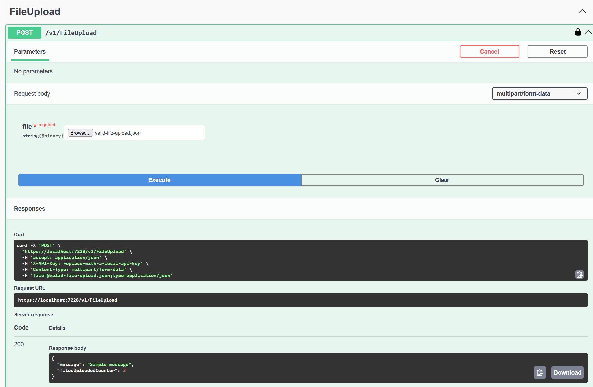

# ALONZO_09212026

Demonstrates a .NET Web API with secure file upload and simple reporting.

## Architecture Diagram

[](project-initial-diagram.png)

[View the diagram directly](project-initial-diagram.png)

### Components

- **User:** Uploads a JSON file with an API key and receives the upload response.
- **`ApiKeyAuthenticationHandler`:** Reads the `X-API-Key` header, compares it with `FILE_UPLOAD_API_KEY` using a fixed-time comparison, and returns `401 Unauthorized` when the key is missing or invalid.
- **`ApiKeyAuthenticationDefaults`:** Defines the `ApiKey` authentication scheme and the `X-API-Key` header name.
- **`LocalEnvironmentFile`:** Loads `.env.local` for local `dotnet run` execution without committing secrets to the repository. Docker receives the same value through `--env-file`.
- **`FileUploadController`:** Requires `[Authorize]`, accepts the multipart `file`, streams and validates its JSON content, and maps duplicate events to `409 Conflict`.
- **`FileUploadRequest`:** Represents the uploaded JSON contract with `EventId`, `EventType`, and `Message` validation.
- **`FileUploadEventType`:** Defines the currently recognized event type, `OneAndOnlyEventType`.
- **`FileUploadService`:** Coordinates persistence of a validated request and creates the `FileUploadResponse`.
- **`IFileUploadService`:** Defines the service-layer upload operation used by the controller.
- **`SqliteFileUploadRepository`:** Uses raw `Microsoft.Data.Sqlite` commands to initialize the schema, insert records, read records, and count records without EF Core.
- **`IFileUploadRepository`:** Defines the repository operations for initialization, saving, reading, and counting upload records.
- **`FileUploadRecord`:** Persistence entity representing one SQLite row with `Id`, `EventId`, `EventType`, `Message`, and `CreatedAtUtc`. The uploaded file contents are not stored.
- **`DuplicateEventIdException`:** Translates the SQLite unique constraint on `EventId` into a clean API conflict response.
- **`FileUploadResponse`:** Returns the event message and the current number of stored uploads.
- **SQLite `FileUploads` table:** Stores at most the latest 100 records. `EventId` is unique and the raw uploaded file is never persisted.
- **Docker volume:** Mounts `/app/data` so the SQLite database survives container replacement.

## API Endpoints

### Swagger

Swagger UI is available at `/swagger`.

Use the **Authorize** button and enter the value from `FILE_UPLOAD_API_KEY`. The API key is sent using the `X-API-Key` header.

### Upload File

```text
POST /v1/FileUpload
```

Headers:

```text
X-API-Key: your-api-key
Content-Type: multipart/form-data
```

The multipart form field is named `file`. The uploaded file must contain a JSON object matching `FileUploadRequest`:

```json
{
  "eventId": "1234567e-8e96-12d3-456-426655440000",
  "eventType": "OneAndOnlyEventType",
  "message": "Sample message"
}
```

Example using the included sample file:

```bash
curl --request POST \
  --header "X-API-Key: your-api-key" \
  --form "file=@samples/valid-file-upload.json" \
  http://localhost:5126/v1/FileUpload
```

Successful response:

```json
{
  "message": "Sample message",
  "filesUploadedCounter": 1
}
```

Successful Swagger upload:



The API returns `400 Bad Request` for invalid JSON or invalid request fields, `401 Unauthorized` for a missing or invalid API key, and `409 Conflict` when the `eventId` already exists.

Only the event contract is stored. The uploaded file itself is not persisted. SQLite keeps the latest 100 records in the `FileUploads` table.

## Local Development

Create `.env.local` in the repository root:

```env
FILE_UPLOAD_API_KEY=replace-with-a-local-api-key
```

Run the API with the HTTP launch profile:

```bash
dotnet run --project src/FileUploadAndReport.Demo.Api --launch-profile http
```

The local API is available at `http://localhost:5126` and Swagger is available at `http://localhost:5126/swagger`.

The SQLite database is created at `src/FileUploadAndReport.Demo.Api/data/fileuploads.db` during local development.

## Docker

Build the image from the repository root:

```bash
docker build --tag file-upload-demo-api .
```

Run the container using the same `.env.local` file and a named volume for SQLite persistence:

```bash
docker run --rm \
  --env-file .env.local \
  --volume fileupload-data:/app/data \
  --publish 8080:8080 \
  file-upload-demo-api
```

The container API is available at `http://localhost:8080` and Swagger is available at `http://localhost:8080/swagger`.

The `.env.local` file is supplied at runtime and is not copied into the Docker image. The named `fileupload-data` volume preserves the SQLite database when the container is replaced.

## Project Structure

```text
.
├── ALONZO_09212026.slnx
├── README.md
├── project-initial-diagram.png
├── Dockerfile
├── .env.example
├── samples/
│   ├── valid-file-upload.json
│   └── invalid-file-upload.json
├── docs/
│   └── requirements.md
└── src/
    └── FileUploadAndReport.Demo.Api/
        ├── FileUploadAndReport.Demo.Api.csproj
        ├── Program.cs
        ├── appsettings.json
        ├── appsettings.Development.json
        ├── Authentication/
        ├── Configuration/
        ├── Controllers/
        ├── Contracts/
        ├── Repositories/
        ├── Services/
        ├── FileUploadAndReport.Demo.Api.http
        └── Properties/
            └── launchSettings.json
```

## Requirements

The project requirements are documented in [`docs/requirements.md`](docs/requirements.md).
