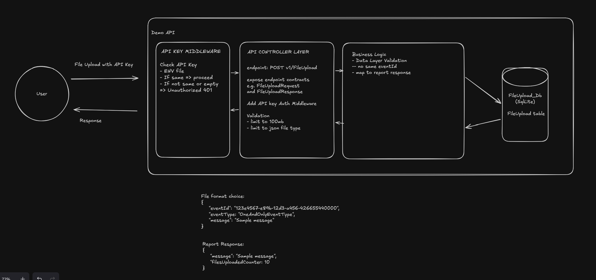

# ALONZO_09212026

Demonstrates a .NET Web API with secure file upload and simple reporting.

## Architecture Diagram

[](project-initial-diagram.png)

[View the diagram directly](project-initial-diagram.png)

### Components

- **User:** Uploads a JSON file with an API key and receives the report response.
- **API Key Middleware:** Validates the request API key and rejects missing or invalid keys with `401 Unauthorized`.
- **API Controller Layer:** Exposes `POST /v1/FileUpload`, validates the request, and applies upload limits.
- **Business Logic:** Validates the uploaded data, prevents duplicate `eventId` values, and creates the report response.
- **SQLite Database:** Stores uploaded file records in the `FileUpload` table.
- **JSON File Format:** Defines the uploaded event data, including `eventId`, `eventType`, and `message`.
- **Report Response:** Returns the processed message and the total number of uploaded files.

## Initial Project Structure

```text
.
├── ALONZO_09212026.slnx
├── README.md
├── project-initial-diagram.png
├── docs/
│   └── requirements.md
└── src/
    └── FileUploadAndReport.Demo.Api/
        ├── FileUploadAndReport.Demo.Api.csproj
        ├── Program.cs
        ├── appsettings.json
        ├── appsettings.Development.json
        ├── FileUploadAndReport.Demo.Api.http
        └── Properties/
            └── launchSettings.json
```

## Requirements

The project requirements are documented in [`docs/requirements.md`](docs/requirements.md).
